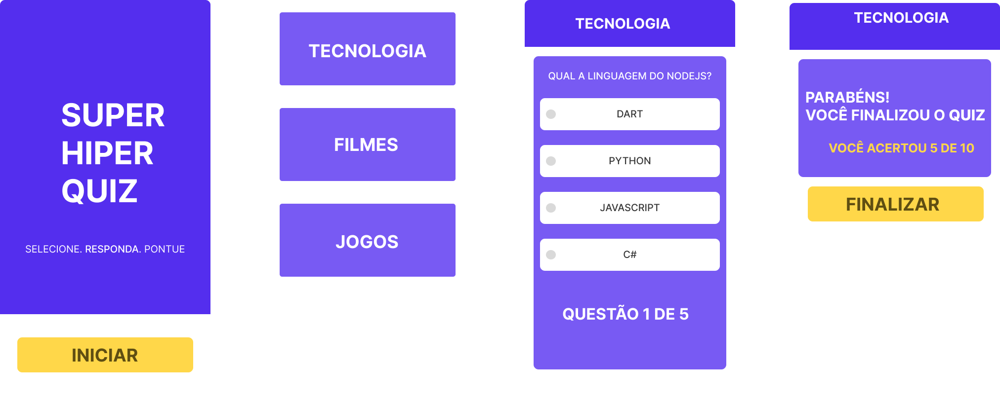
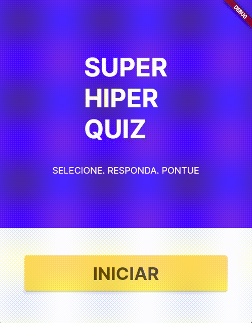

# QUIZ APP

## Table of contents

- [Overview](#overview)
- [Como foi desenvolvido](#como-foi-desenvolvido)
- [Linguagens e Techs utilizadas](#linguagens-e-techs-utilizadas:books:)
- [Funcionamento](#funcionamento)
- [Criado por](#criado-por)

## Overview

O desafio foi desenvolver um jogo Quiz, onde o usuário pudesse responder conforme seleção de categoria.
 
Os usuários podem:

:trophy: - Selecionar categorias para responder
:trophy: - Responder questões
:trophy: - Conferir a quantidade de questões
:trophy: - Visualizar a quantidade de acertos

## Como foi desenvolvido

### 1. Criado um mockup pelo figma para seguir durante desenvolvimento.

 

#### Cores principais do jogo:

- #542EEE
- #785AF3
- #FFD749
 

#### Tipografia:

- Inter (Bold, Regular)

## Linguagens e Techs utilizadas :books:

- [Flutter](https://flutter.dev/)

## Funcionamento

Para rodar em sua máquina, use o <code>flutter run</code>

## Criado por

- Linkedin - [Willian Henkel](https://www.linkedin.com/in/willian-henkel-b652b3205/)
 
- Email - willianhenkel@gmail.com

